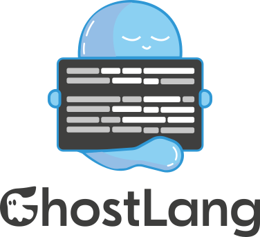

<p align="center">
  
</p>

<p align="center">
  <strong>Translate whatever's on your screen or coming out of your speakers - live, in 20 languages.</strong>
</p>

<p align="center">
  <a href="https://dotnet.microsoft.com/download/dotnet/8.0"></a>
  
  
  
  <a href="README.ru.md"></a>
</p>

---

GhostLang is a Windows app for translating your screen and the audio playing through your system. It gives you the tools to transcribe and translate pretty much any digital content you come across - manga pages, game UI, articles, podcasts, YouTube, game streams - without jumping between tabs or copying text by hand.

You pick a region on your screen or switch on system audio capture, and the app overlays the translated text on top of the original or drops it on the desktop as subtitles. Nothing leaves your machine unless you explicitly turn on a cloud engine.

## What sets it apart

Most desktop translators stop at screen OCR. GhostLang treats screen and audio as equal citizens - they share the same translation cache, the same glossary of protected terms, and the same benchmark harness. If you're translating a game stream, the dialogue subtitles and the UI tooltips both flow through the same pipeline.

It's also the only one in this space with a real **benchmark UI built in**: ablation presets, per-step latency breakdown, CER/WER/BLEU/chrF metrics, CSV export. Everything in the Debug tab, usable without touching code.

A few other things people notice:

- **Runs fully offline** if you want. Tesseract + Whisper + a local translation engine and you're done. Cloud engines (Azure Vision, Azure Speech) are there if you need them, not required.
- **GPU-accelerated ASR** via Whisper's Vulkan backend. Works on NVIDIA, AMD, Intel - anything with a modern driver. Usually 3–10× faster than CPU.
- **Adaptive capture.** Reading a manga page? The screen pipeline slows down to 0.5 FPS and goes idle. Watching a stream? It jumps to 5 FPS the moment something changes.

## Features

### Screen translation

- Pick a rectangular region of your screen with the mouse. The overlay is click-through, so it doesn't get in the way of the window below.
- OCR engines you can choose from: **Tesseract** (local, 20 languages), **Windows OCR**, **Azure Vision**, **OCR.space**.
- Smart erasure of the original text via **OpenCV inpainting**, or a fast solid-color wipe if you'd rather save CPU.
- Translated text gets rendered back in place - same approximate color, same size.
- Capture rate adapts to content (200–5000 ms), configurable per session.
- Recording mode hides the overlay from OBS and other screen recorders, so your stream stays clean.

### Audio translation

- Source: microphone or system loopback (WASAPI).
- Voice activity detection: a cheap RMS gate or the neural **Silero** model (200 MB, much better at rejecting background noise).
- ASR engines: **Whisper** (local, 5 model sizes, GPU via Vulkan), **Vosk** (local, streaming), **Azure Speech** (cloud).
- Subtitles appear on any monitor, any corner, with fade-in/out. You can also hide them with a hotkey.
- Drift indicator warns you if the translation is falling behind real-time capture.

### Shared

- 20 languages: English, Russian, Spanish, German, French, Japanese, Chinese (Simplified / Traditional), Italian, Portuguese, Polish, Korean, Arabic, Turkish, Ukrainian, Dutch, Vietnamese, Hindi, Thai, Hebrew.
- Translation engines: **GTranslate** (Google, Yandex, Bing, Microsoft), **MyMemory**, **Lingva**, **LibreTranslate**.
- Translation cache lives on disk and survives restarts.
- Glossary lets you mark terms you want left alone (product names, characters, jargon) - they get protected from the MT engine.
- Global hotkeys for everything: region selection, start/stop, subtitle toggle, window nudging.
- UI language: English or Russian. Theme: dark or light.

## Screenshots

> Screenshots are on the way - coming in the next release.

## Requirements

- Windows 10 build 19041 or newer.
- .NET 8.0 Desktop Runtime (bundled in release builds).
- For GPU Whisper: a GPU with a Vulkan driver. Most Windows 10+ systems have this already.

## Installation

### From source

```bash
git clone https://github.com/dZatr1k/GhostLang.git
cd GhostLang/src
dotnet build GhostLang.sln -c Release
dotnet run --project GhostLang.WPF/GhostLang.WPF.csproj -c Release
```

### Prebuilt

Download the latest `GhostLang-v*-win-x64.zip` from [Releases](https://github.com/dZatr1k/GhostLang/releases), unzip, run `GhostLang.WPF.exe`.

## Configuration

Settings are saved to `appsettings.user.json` next to the executable (created on first launch). The Settings page autosaves on a 400 ms debounce - no Save button.

Models live here:

```
<exe>/Models/
├── Tesseract/           - language packs, download on demand from Settings
├── Whisper/             - ggml models (base/small/medium/large-v3)
├── Vosk/                - unpack archives into this folder, app picks them up
└── Silero/              - silero_vad.onnx, download from Settings
```

## Benchmarks (v0.1 beta)

Results from the representative 3-sample screen corpus (manga JA→RU, game UI EN→RU, website EN→RU):

| Metric | Before optimizations | v0.1 | Speedup |
|--------|----------------------|------|---------|
| Average latency | 1371 ms | **418 ms** | **3.3×** |
| Manga panel | 2418 ms | 762 ms | 3.2× |
| Game UI | 798 ms | 129 ms | 6.2× |
| Website | 897 ms | 364 ms | 2.5× |

The full corpus (60 samples, 3 categories × 2 pipelines) is being built and will ship with v0.2. To reproduce the numbers yourself, open **Debug → Benchmark → Ablation**.

## Architecture, briefly

Two projects:

- **GhostLang.Core** - pipelines, engine abstractions, benchmark runner. Framework-agnostic (`net8.0-windows`).
- **GhostLang.WPF** - the UI, MVVM on CommunityToolkit.Mvvm, DI through Microsoft.Extensions.Hosting.

Pipeline steps implement `IMandatoryPipelineStep` or `IOptionalPipelineStep` and run in order via `IPipelineBuilder`. The pipeline is built once per session and reused across ticks, so expensive native resources (Tesseract handle, Whisper factory, Vosk model) stick around instead of getting rebuilt every frame.

## Compared to similar tools

| | GhostLang | QTranslate | ScreenTranslator | LunaTranslator | Translumo | MORT |
|---|:---:|:---:|:---:|:---:|:---:|:---:|
| Screen translation | ✅ | ✅ | ✅ | ✅ | ✅ | ✅ |
| Audio translation | ✅ | ❌ | ❌ | partial (text hook) | ❌ | ❌ |
| Local ASR (Whisper) | ✅ | - | - | - | - | - |
| GPU acceleration | ✅ | ❌ | ❌ | partial | ❌ | ❌ |
| Adaptive capture rate | ✅ | ❌ | ❌ | ❌ | ❌ | ❌ |
| Neural VAD | ✅ | - | - | - | - | - |
| Persistent cache | ✅ | ❌ | ❌ | ❌ | ❌ | ❌ |
| Built-in benchmark | ✅ | ❌ | ❌ | ❌ | ❌ | ❌ |

## Under the hood

| Purpose | Package |
|---------|---------|
| Translation | GTranslate, Azure.AI.Vision.ImageAnalysis |
| OCR | Tesseract 5.x, Windows.Media.Ocr |
| ASR | Whisper.net (+ Vulkan runtime), Vosk, Microsoft.CognitiveServices.Speech |
| Image inpainting | OpenCvSharp4 |
| Image rendering | SixLabors.ImageSharp |
| Neural VAD | Microsoft.ML.OnnxRuntime + Silero VAD v5 |
| Audio capture | NAudio (WaveInEvent, WasapiLoopbackCapture) |
| UI | WPF, HandyControl, CommunityToolkit.Mvvm |
| DI / Hosting | Microsoft.Extensions.Hosting |

## Roadmap

v0.1 covers the core pipeline and the benchmark harness. Planned for later releases:

- A UI redesign pass based on the internal design spec.
- Optional CUDA runtime for Whisper (around 1 GB extra install).
- Streaming ASR with partial subtitles that update word-by-word.
- Portable cache format so you can move your translation history between machines.
- Linux and macOS ports on a non-WPF UI stack.

## License

MIT. See [LICENSE](LICENSE).

## Author

dZatr1k - diploma thesis project, MIREA, 2026.
